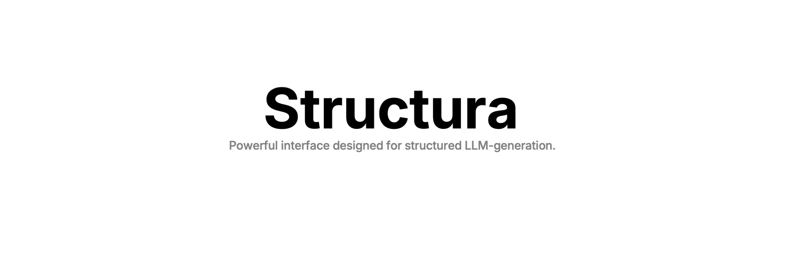
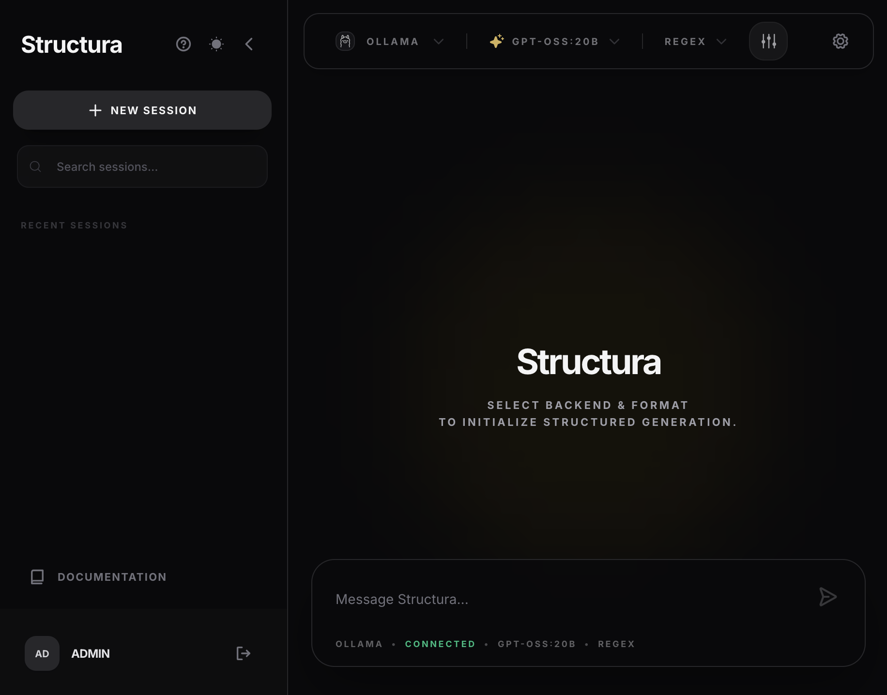
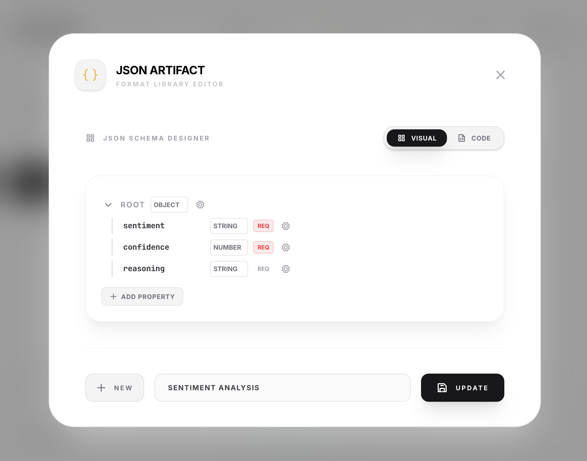
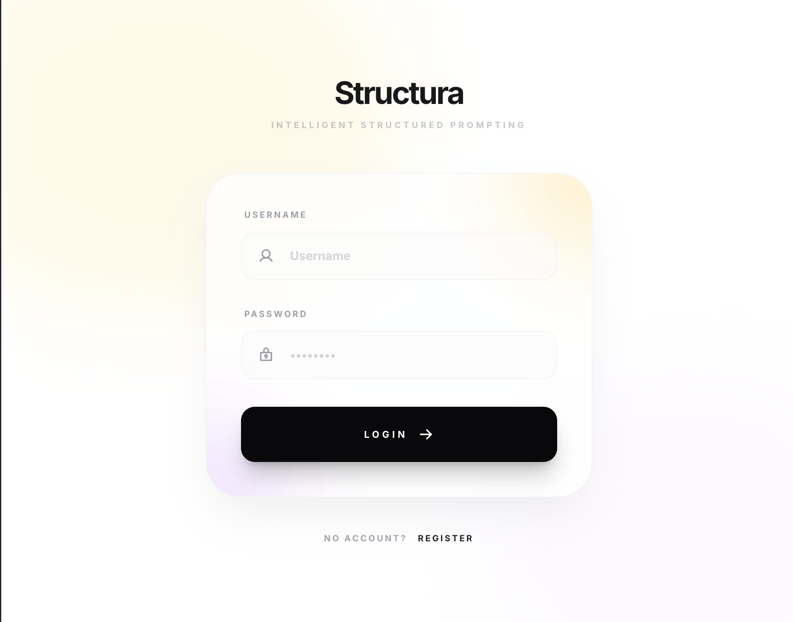

<p align="center">
  
</p>

<p align="center">
  
  
  
</p>

**Structura** is a professional web interface designed for **guaranteed structured outputs** from Large Language Models. It enables developers to bridge the gap between stochastic LLM responses and deterministic application logic through rigorous schema enforcement, regex constraints, and template-based generation.

<p align="center">
  
</p>

## 🚀 Key Features

- **Structured Output Modes**: 
  - **JSON Schema**: Native JSON mode with GUI-based schema construction.
  - **Regex Engine**: Force models to strictly follow regular expression patterns.
  - **Templates**: "Fill-in-the-gap" generation using `[GEN]` placeholders.
- **Visual Artifact Libraries**: Manage your patterns, schemas, and templates in one place.
- **Multi-Backend Support**: Seamlessly switch between **Ollama**, **vLLM**, and **OpenAI**.
- **Thematic Consistency**: Full support for Dark & Light modes.

## 📸 Visual Editing

| JSON Schema Builder | Regex Pattern Editor |
|---|---|
|  |  |

| Template Editor | Resulting Output |
|---|---|
|  |  |

## ✨ Theme Support

Whether you prefer the tactical feel of **Dark Mode** or the clean aesthetics of **Light Mode**, Structura adapts to your workflow.

| Dark Mode | Light Mode |
|---|---|
|  |  |

## 🛠️ Getting Started

### Prerequisites

- **Docker & Docker Compose** (Recommended)
- OR **Python 3.10+** & **Node.js 18+**
- (Optional) **Ollama** or **vLLM** for local inference.

### Installation (Docker - Quick Start)

The easiest way to run Structura is using Docker:

```bash
git clone https://github.com/NilsHellwig/structura.git
cd structura
docker-compose up --build
```

Access the UI at [http://localhost:3000](http://localhost:3000).

### Installation (Manual)

1. **Clone the repository**:
```bash
git clone https://github.com/NilsHellwig/structura.git
cd structura
```

2. **Backend Setup**:
```bash
cd backend
python -m venv venv
source venv/bin/activate  # or venv\Scripts\activate on Windows
pip install -r requirements.txt
uvicorn app.main:app --reload
```

3. **Frontend Setup**:
```bash
cd frontend
npm install
npm run dev
```

## 📖 Documentation

Detailed documentation is available in the [Documentation section](frontend/src/docs/intro.md) including:
- [Concepts & Architecture](frontend/src/docs/concepts.md)
- [Local LLM Setup (Ollama/vLLM)](frontend/src/docs/ollama.md)
- [JSON Schema Guide](frontend/src/docs/json.md)
- [Regex Constrained Generation](frontend/src/docs/regex.md)

## 🤝 Contributing

We welcome contributions! Please see our [Contributing Guidelines](CONTRIBUTING.md) and [Code of Conduct](CODE_OF_CONDUCT.md).

## 🆘 Support & Questions

Have a question or found a bug? 
- **GitHub Issues**: For bug reports and feature requests.
- **GitHub Discussions**: For general questions, ideas, and showcasing your projects.

### 🌟 Support the project
If you find Structura useful, please **give it a star on GitHub!** It helps the project grow and reach more developers.

## 📄 License

Apache-2.0 License - see the [LICENSE](LICENSE) file for details.

---

<p align="center">Built for the future of structured AI.</p>
