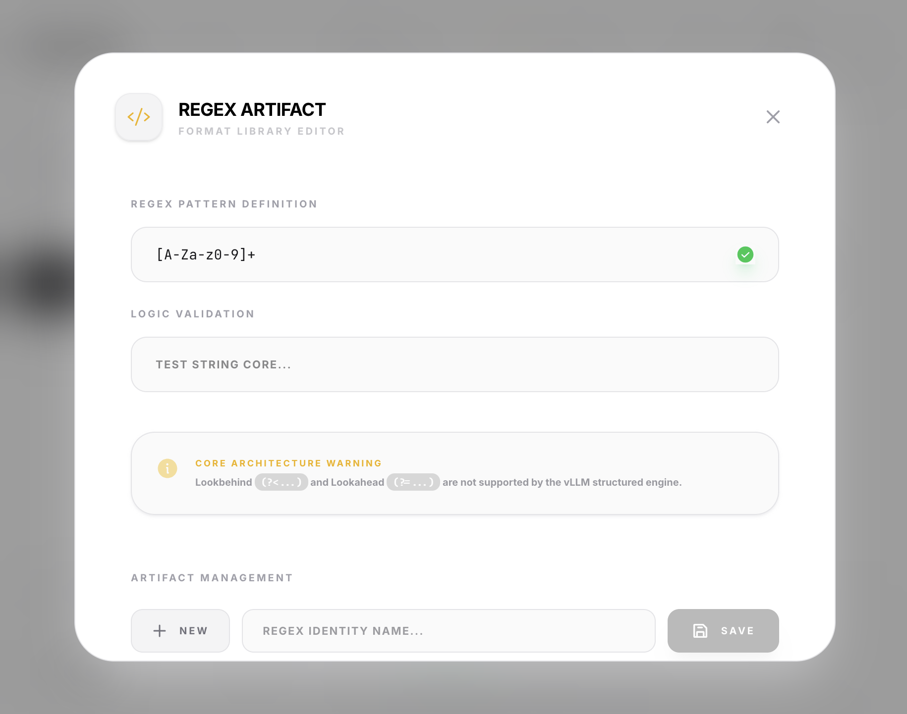

# Regex Constrained Generation

Regular Expressions (Regex) provide the most granular control over LLM outputs. This mode is particularly useful for generating non-conversational tokens like identifiers, codes, or strictly formatted metadata.

## Backend Support

- **vLLM**: Robust support via the `structured_outputs` API.
- **Ollama**: Supported via native grammar conversion.
- **OpenAI**: Note that OpenAI does not natively support Regex constraints. Structura will fallback to prompting techniques if Regex is selected with an OpenAI backend.

## Use Cases

- **Validation Codes**: `[A-Z0-9]{8}`
- **Standardized Identifiers**: `ITEM-\d{5}-[a-z]{2}`
- **Temporal Data**: `\d{2}/\d{2}/\d{4} \d{2}:\d{2}`

## Best Practices

1. **Be Precise**: Use anchors like `^` and `$` if your backend supports them, though Structura usually handles the surrounding context.
2. **Escaping**: Remember to escape reserved characters if they should be part of the literal output (e.g., `\.` or `\( \)`).
3. **Drafting**: Use tools like [Regex101](https://regex101.com/) to test your patterns before importing them into Structura.

## Limitations

For technical reasons involving the grammar engine:
- **Lookaheads/Lookbehinds** are generally not supported in the constrained sampling libraries used by backends.
- **Recursion** is limited.
- **Complexity**: Extremely complex regex patterns can slow down initial token generation as the backend builds the finite state machine (FSM).

For advanced Regex learning, refer to the [MDN Regular Expressions guide](https://developer.mozilla.org/en-US/docs/Web/JavaScript/Guide/Regular_expressions).
