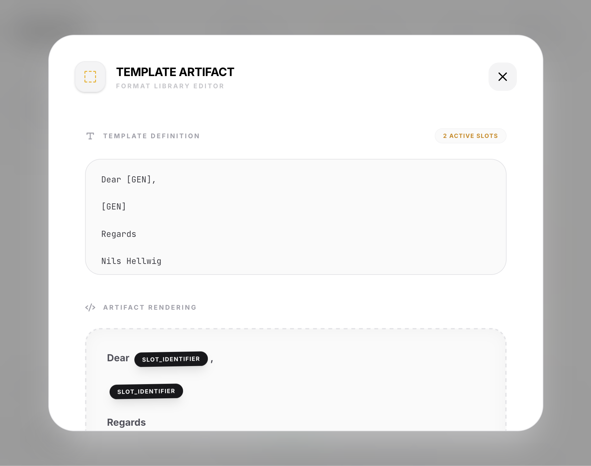

# Template Generation

Templates allow for "Fill-in-the-blank" style interactions. This is the most powerful tool in Structura for generating semi-structured documents such as medical reports, legal summaries, or standardized emails.



## The `[GEN]` Placeholder

Structura uses a proprietary `[GEN]` tag to denote sections of a document that the AI should produce. Any text outside of these tags is considered "Static Content" and is guaranteed to be returned exactly as written.

### Example Template:

```text
PATIENT NAME: [GEN]
DIAGNOSIS CODE: [GEN]

CLINICAL NOTES:
[GEN]

RECOMMENDED FOLLOW-UP:
1. [GEN]
2. [GEN]
```

## Best Practices for Templates

- **Use Descriptive Headers**: The text preceding a `[GEN]` tag acts as a powerful local prompt. Instead of just `Field: [GEN]`, use `Key Performance Indicator: [GEN]`.
- **Formatting Matters**: Newlines and spacing in your template will be preserved exactly. Use this to create aesthetic reports.
- **Backend Limitations**: Since templates are converted to Regex, the same limitations (no lookaheads, high complexity) apply. Large templates with many `[GEN]` tags may take longer to initialize.

## Internal Mechanism

When a template is sent to a backend like **vLLM** or **Ollama**, Structura converts the template into a complex Regular Expression. This Regex forces the model to repeat the static text exactly and only "generate" text at the `[GEN]` positions.

## Advantages

- **Zero Conversion Overhead**: No need to parse JSON back into text; the output is exactly the document you need.
- **Context Injection**: By providing static headers, you guide the model's focus for each specific generation block.
- **Consistent Layout**: Perfect for internal tools that expect a specific line-by-line format.


## How Structura Handles Templates
When a template is used, Structura:
1. Translates the template into a complex Regex pattern.
2. Sends the pattern to the backend (like Ollama).
3. The LLM then generates text that fits *exactly* into those slots, preserving all your static text (like "TITLE:", "SUMMARY:", etc.).
